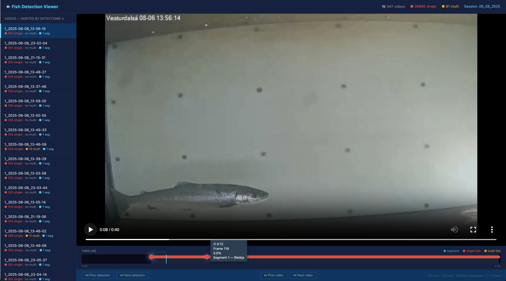

# Fish Detection System

An AI-powered tool for finding fish in underwater video. Point it at a folder of MP4 files; get back an interactive timeline showing every moment a fish appears, so you don't have to scrub through hours of footage by hand.

Built at the **Marine and Freshwater Research Institute of Iceland (Hafrannsóknastofnun)** for salmonid monitoring, but adaptable to other species and settings.

**Author:** João da Silva Martins — `joao.da.silva.martins@hafogvatn.is`

---

## What it does

You give it videos. It tells you:

- **Which videos contain fish**, and **at which frames** (timestamps).
- **Single-fish vs. multi-fish moments** — useful for counting passages or detecting shoaling behaviour.
- A clickable **timeline viewer** that opens in your browser: click a marker → jump to that moment in the video.
- Machine-readable **JSON output** if you want to do your own analysis afterwards (e.g. in R or Python).

It does **not** classify species, count individuals, or track fish across frames. It answers "is there a fish visible here?" — that's the unit of analysis.



## Who this is for

This tool was built and tuned for **salmonid-like fish** (salmon, trout, char) filmed in:

- Fish-pass / fish-counter installations
- Contained tanks or raceways (aquaculture)
- River monitoring stations with reasonably clear water

It will likely also work — possibly with reduced accuracy — on other fish in similar conditions. The detection prompts can be edited to target other species; see **Adapting to other species** below.

It is unlikely to work well on:

- Heavily turbid water
- Deep-sea or low-light footage with no visible fish silhouette
- Schools of small pelagic fish (sardines, herring) at distance
- Crab, eels, or invertebrates (it has no concept of these)

---

## Quick Start (assuming you already have [uv](https://docs.astral.sh/uv/) installed)

```bash
# 1. Install everything (creates an isolated environment from uv.lock)
uv sync

# 2. Detect single fish across all videos in a folder
uv run uv run python fish_detection/fish-detection.py single --video-dir ./data/my_videos

# 3. (Optional) Detect multi-fish moments — must run single detection first
uv run uv run python fish_detection/fish-detection.py multi --video-dir ./data/my_videos

# 4. Open the interactive timeline viewer in your browser
uv run uv run python fish_timeline_viewer.py --session my_videos
```

The `--session` name is just the folder name from step 2 (`my_videos` in the example). The viewer auto-merges both single- and multi-fish results if both have been computed.

> **First run takes ~5 minutes longer than subsequent runs** because the AI model (~2 GB) is downloaded automatically.

### Try it on the included test videos

A small set of test videos is bundled at `data/video_temp_test/` so you can confirm your installation works before pointing the tool at your own footage:

```bash
uv run uv run python fish_detection/fish-detection.py single --video-dir ./data/video_temp_test
uv run uv run python fish_timeline_viewer.py --session video_temp_test
```

Your browser should open with the timeline viewer and several fish detections visible.

---

<details>
<summary><b>First-time setup for non-technical users (click to expand)</b></summary>

If you've never run a command-line tool before, follow these steps. Everything happens in the **Terminal** (macOS / Linux) or **PowerShell** (Windows).

### Step 1 — Install `uv`

`uv` is a small tool that manages Python and project dependencies for you. You only need to install it once.

```bash
# macOS / Linux
curl -LsSf https://astral.sh/uv/install.sh | sh

# Windows (PowerShell)
powershell -ExecutionPolicy ByPass -c "irm https://astral.sh/uv/install.ps1 | iex"
```

After installing, close and reopen your terminal. Check it worked:

```bash
uv --version
```

You should see a version number. You do **not** need to install Python separately — `uv` will fetch the correct version automatically.

### Step 2 — Download this project

If you were given a ZIP file: unzip it, and remember where you put the folder.

If you have `git` installed:

```bash
git clone <repository-url>
cd fish-detection
```

Otherwise, open a terminal and `cd` into the folder where you unzipped it.

### Step 3 — Install dependencies

```bash
uv sync
```

This single command:
- downloads the correct Python version,
- creates an isolated environment for the project,
- installs PyTorch, OpenCLIP, OpenCV and everything else, using the exact versions recorded in `uv.lock`.

It takes a few minutes the first time. There's nothing to "activate" — just prefix your commands with `uv run` (as shown in the Quick Start above) and `uv` handles the rest.

### Step 4 — Put your videos somewhere sensible

Create a folder inside `data/`, e.g. `data/site_skjalfandafljot/`, and copy your `.mp4` files into it. The name of this folder becomes your **session name**.

You're now ready to run the **Quick Start** commands above. If you'd like to try the tool first without setting up your own data, the bundled test videos in `data/video_temp_test/` are a good starting point.

</details>

---

## Detailed Usage

### Detecting fish

```bash
# All videos in a folder
uv run python fish_detection/fish-detection.py single --video-dir ./data/site_A

# Specific videos
uv run python fish_detection/fish-detection.py single --videos clip1.mp4 clip2.mp4

# Multi-fish pass (requires single detection to have run already)
uv run python fish_detection/fish-detection.py multi --video-dir ./data/site_A

# Custom output location
uv run python fish_detection/fish-detection.py single --video-dir ./data/site_A --output-dir ./results
```

**Why "single first, then multi"?** Multi-fish detection is more expensive, so it only re-examines the frames that single-detection already flagged as containing fish. This makes a full multi-fish pass over a long video tractable.

### Viewing results

```bash
uv run python fish_timeline_viewer.py --session site_A

# Don't open the browser automatically (useful on remote servers)
uv run python fish_timeline_viewer.py --session site_A --no-browser
```

The viewer copies your videos into the session folder (so the browser can play them locally) and starts a small web server. Click a coloured marker on the timeline to jump to that moment.

---

## How it works (short version)

1. **Frame sampling.** Every 3rd frame of the video is examined (≈10 fps for 30 fps footage). This is a good speed/accuracy trade-off; nothing fish-relevant tends to appear and disappear in 1/10 of a second.
2. **AI analysis.** Each sampled frame is scored by **OpenCLIP (ViT-SO400M-14-SigLIP)**, a vision-language model. The model compares the frame against fish-related text descriptions ("a salmon-like fish swimming...") versus empty-scene descriptions, and returns a probability.
3. **Thresholding.** Frames above a tuned probability threshold (0.978 for single fish, 0.962 for multi) are flagged.
4. **Segmenting.** Consecutive flagged frames are grouped into **segments** (a contiguous fish visit). Gaps shorter than 2 seconds are bridged; segments shorter than 1 second are discarded as likely false positives.
5. **Output.** Results are written as JSON (machine-readable) and rendered as an interactive HTML timeline (human-readable).

---

## Interpreting the results

### What a "probability" means

The probability score (e.g. `0.985`) is the model's confidence that the frame contains a fish, **relative to the alternative prompts it was given**. It is *not* a calibrated biological probability — treat it as a ranking, not a guarantee.

- **> 0.99** — very likely a real detection.
- **0.97–0.99** — usually correct, but worth a quick eyeball check, especially in turbid water.
- **Below threshold** — not reported, but the raw scores are saved in `scores.pkl` if you want to re-threshold later.

### Recommended workflow for biologists

1. Run single detection on a small **representative sample** (e.g. 10 minutes from each site).
2. Open the timeline viewer and spot-check 20–30 detections. Note false positives (debris, shadows, reflections) and missed fish.
3. If accuracy looks acceptable, run the full dataset overnight.
4. Use the JSON output (`output/detection_output/<session>/fish_detection/results.json`) to compute the biological metrics you actually care about: visit counts, residence time, diel patterns, etc.

### Output structure

```
output/detection_output/<session_name>/
├── fish_detection/              # Single-fish pass
│   ├── results.json             # Flagged frames + segments (use this)
│   ├── scores.pkl               # Raw per-frame probabilities (advanced use)
│   └── videos/                  # Local copies (for the viewer)
├── multi_fish/                  # Multi-fish pass (if run)
│   └── ...
└── timeline_viewer.html         # Interactive viewer
```

### JSON format

```json
{
  "/absolute/path/to/clip.mp4": {
    "total_frames": 18000,
    "frames_processed": 6000,
    "fish_frames": [
      { "frame": 45, "probability": 0.985 },
      { "frame": 48, "probability": 0.991 }
    ],
    "segments_summary": {
      "total_segments": 3,
      "segments": [
        { "segment_number": 1, "start_frame": 45, "end_frame": 132, "size": 30 }
      ]
    }
  }
}
```

To convert frame numbers to timestamps: `time_in_seconds = frame_number / fps`. Typical fps is 25 or 30 — check the video properties to be sure.

---

## Adapting to other species

The detection works by comparing each frame to a small set of **text prompts** that describe what you're looking for. These are defined in `fish_detection/fish-detection.py` (look for `positive_prompts` and `negative_prompts`).

To target a different species or scene, edit those prompts. For example, for eels in a fish pass you might change the positives to:

```python
positive_prompts = tokenizer([
    "An eel swimming in a fish pass",
    "An underwater photo of an eel",
    "A long, snake-like fish in a contained channel"
], ...)
```

You will likely also need to **re-tune the threshold** (`self.threshold`) on a labelled sample of your own footage. The defaults were calibrated for salmonids and won't transfer directly.

---

## System Requirements

- **Python:** managed automatically by `uv` (currently 3.11, pinned in `.python-version`)
- **RAM:** 8 GB minimum, 16 GB recommended
- **Disk:** plan for ~2× the size of your input videos (the viewer keeps local copies); the AI model itself is ~2 GB
- **GPU (optional, but ~10× faster):** NVIDIA GPU with CUDA, or Apple Silicon (M1/M2/M3/M4). CPU-only works but is slow on long footage.

---

## Troubleshooting

**"No videos found"** — only `.mp4` is recognised. Convert other formats (e.g. with VLC or ffmpeg) before running.

**"Model loading failed" / hang on first run** — the model is downloading (~2 GB). Make sure you have internet access and disk space. Subsequent runs use the local cache.

**Timeline viewer won't open** — port 8000 may be in use. Close other local servers or restart the terminal. On corporate networks, a firewall may block the local HTTP server.

**Out-of-memory error on GPU** — your GPU is too small for the default batch size (128). Lower the `batch_size` constant in `fish_detection/fish-detection.py`.

**Multi-fish detection finds nothing** — confirm single detection was run first and produced results in `output/detection_output/<session>/fish_detection/results.json`. Multi-fish only re-examines frames already flagged by single detection.

---

## Limitations and honest caveats

- This is a research tool, not a certified counting instrument. Always validate against ground truth before drawing biological conclusions.
- The model has **no concept of individual identity** — the same fish swimming back and forth will be counted as multiple detections.
- "Multi-fish" is a coarse signal: it tells you a frame likely contains more than one fish, not how many.
- Performance on **species other than salmonids has not been systematically evaluated**.
- The model is sensitive to lighting and water clarity; results from different sites are not directly comparable without site-specific validation.

---

## Citation

If you use this tool in published research, please cite:

> da Silva Martins, J. (2026). *Fish Detection System: AI-assisted detection of salmonids in underwater video.* Marine and Freshwater Research Institute of Iceland (Hafrannsóknastofnun).

## License

TBD — contact the author before redistributing or using in production monitoring.

## Support

For bug reports, feature requests, or questions about adapting the tool to your study system, email the author.
